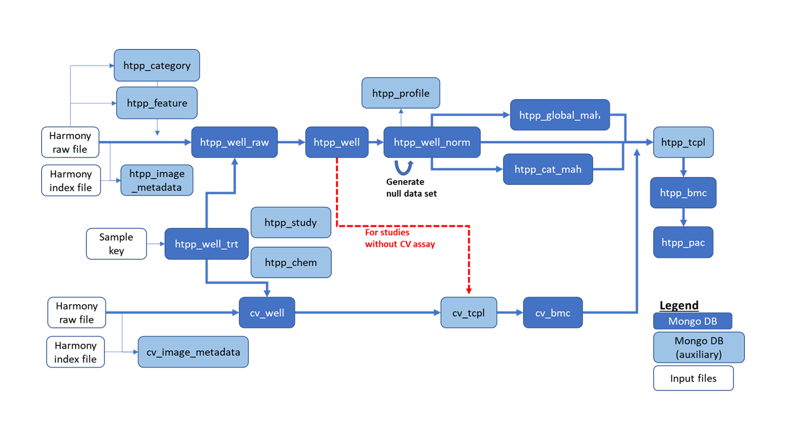

# Introduction

The goal of this vignette is to walk through a typical pipelining of high-throughput phenotypic profiling (HTPP) data using the *htpp.pl* R package. The underlying source code and methodology of *htpp.pl* was established based on the methods outlined in Nyffeler et al., 2021 (https://www.ncbi.nlm.nih.gov/pmc/articles/PMC8673120/) at the US EPA Center for Computational Toxicology and Exposure.

The *htpp.pl* package is designed to perform a complete analysis of HTPP chemical screening experiments. This includes experimental metadata organization, loading and processing Harmony raw cell-level data (*Level 0*), perform well-level normalization (*Level 4*), and z-scale normalize data (*Level 5*), perform several methods for data aggregation, and finally identifying chemical bioactivity using the *tcplfit2* concentration-response modeling R package. 

The *htpp.pl* package saves all data across multiple steps of the pipeline using MongoDB as the database backend. The overall schema of *htpp.pl* is shown in Figure 1.

{width=85%}

### Notes:

* The *htpp.pl* R package provides functions for  processing HTPP data. The manual explaining all of the functions can be found in the *htpp.pl* manual PDF: **~/htpp.pl/htpp.pl_0.3.pdf**
* Many functions in *htpp.pl* that insert data into MongoDB collections will have a 'rerun' or 'replace' parameter that impacts whether existing collections or data within collections are dropped and re-inserted. Please reference function documentation for details.


## Installation

The *htpp.pl* R package is available on the US EPA Github (https://github.com/USEPA/CompTox-htpp.pl). To install the R package, a user can clone the current public release and run devtools::install_local(), or use devtools:install_github(). 

```{r installation, eval=FALSE}
install.packages("devtools")
library(devtools)

#if Github repo was cloned
devtools::install_local(path = "path/to/CompTox-htpp.pl/") #if user cloned repo from Github

#install direct from Github
devtools::install_github("USEPA/CompTox-htpp.pl")

```


# The *htpp.pl* R Package


## R Packages Used by htpp.pl

```{r}
# Primary Packages #
library(tcplfit2)
library(htpp.pl)
library(devtools) #for loading the htpp.pl package
# Timing Packages #
library(tictoc)
# Database Connection Packages #
library(mongolite)
library(jsonlite)
# Data Formatting Packages #
library(data.table)
library(plyr)
library(dplyr)
library(readr)
library(rlist)
library(stringr)
library(tidyr)
# Plotting Packages #
library(ggplot2)
# Table Packages #
library(data.table)
library(tibble)
# Parallelizing Packages #
library(doParallel)
library(foreach)
library(parallel)

```


## Required Input Files


#### KeyFile.R

The 'KeyFile.R' is an R script that houses MongoDB credential information which is used by helper functions and mongolite functions in querying MongoDB data. An example 'KeyFile.R' file is included with this R package for reference.

Users should create this `KeyFile.R` within their home or project directory and then source it to load the MongoDB credentials into their environment.

#### Sample Key

The sample key file provides all sample and experiment metadata for an HTPP study. The *htpp.pl* package provides an example of this file. 

```{r, example sample key}

sample_key <- fread(file = system.file("extdata", "example_sampleKey.csv", package = "htpp.pl"),
                    sep = ",")

sample_key[1:2,]

```

Required columns for an HTPP sample key (with specific examples of metadata columns) are as follows: 

```{r, sample key examples}

#required columns
colnames(sample_key)

#replicate_num -- numerical value associated with the culture replicate. There are typically 3-4 culture replicates in each HTPP experiment.
unique(sample_key$replicate_num)

#cell_type -- a symbol used to denote which cell type a sample originated
unique(sample_key$cell_type)

#culture_id -- an identifier for the culture replicate associated with an assay plate. Typically begins with a lowercase “c” followed by a YYYY-MM-DD notation
unique(sample_key$culture_id)

#pg_id -- plate group ID where a plate group represents a set of HTPP biological replicate plates
table(sample_key$pg_id, sample_key$plate_id) #note that there's 4 HTPP plates in plate group 1

#doseplate_id -- an identifier for the dose plate that was used to dispense a treatment -- typically, a barcode
unique(sample_key$doseplate_id)

#stype -- HTPP sample type, note that 'test sample' refers to test chemical/s 
table(sample_key$stype)

#chem_id-- chemical identifier
sample_key$chem_id[1]

#dtxsid -- DSSTox substance identifier (DTXSID)
sample_key$dtxsid[1]

#casrn -- CAS number of chemical
sample_key$casrn[1]

#chem_name -- typically the preferred name of the chemical tested as listed on the CompTox Chemicals Dashboard (https://comptox.epa.gov/dashboard/)
sample_key$chem_name[1]

#dose_level -- numerical index corresponding to ascending dose levels within a study
unique(sample_key$dose_level)

#conc -- the chemical test concentration
sample_key$conc[1]

#conc_unit -- units associated with the chemical test concentration
sample_key$casrn[1]

#casrn -- CAS number of chemical
unique(sample_key$conc_unit)

#sample_id -- Should be a concatenation of plate_id and well_id, this should also match to the raw Harmony HTPP file in some way (described later)
sample_key$sample_id[1:5]

#plate_id -- identifier for the assay plate -- typically a barcode
sample_key$plate_id[1]

#well_id -- well identifier associated with the position of the sample on the assay plate
sample_key$well_id[1]

#trt_name -- specific treatment name of sample, usually a concatenation of pg_id, chem_id, and dose_level 
sample_key$trt_name[c(1, 50, 500)]

#assay -- Assay type, either 'HTPP' or 'CV' for HTPP cell painting or cell viability plates, respectively
unique(sample_key$assay)

#qc_flag -- QC flag determined from laboratory for each sample. Should be one of: "OK", "CELL_VIABILITY", "DOSEPLATE_FAIL" or "DISPENSE_FAIL"
unique(sample_key$qc_flag)

#qc_flag_description -- column describing the nature of the problem that resulted in a low quality well flag (e.g. DISPENSE_FAIL, NA)
unique(sample_key$qc_flag_description)

```


#### Raw Harmony Files

Raw Harmony files should be stored in a hierarchical way. An example of the file structure for a HTPP experiment with two 384-well plates, Plate_1 and Plate_2, and a cell viability (CV) experiment with one 384-well plate, CV_plate_1, is as follows (bold denotes raw Harmony file). Note that this is the default folder structure created by Harmony software.  

* file_path_to_data/
    + HTPP_experiment/
        - Plate_1/
            + indexfile.txt
            + Evaluation 1/
                - Comment.txt
                - **Objects_Population - Cells-Non-Border.txt**
                - PlateResults.txt
        - Plate_2/
            + indexfile.txt
            + Evaluation 1/
                - Comment.txt
                - **Objects_Population - Cells-Non-Border.txt**
                - PlateResults.txt
    + CV_experiment/
        - CV_plate_1/
            + indexfile.txt
            + Evaluation 1/
                - Comment.txt
                - **Objects_Population - Selected Nuclei.txt**
                - PlateResults.txt


## Data Processing

**The vignette will be broken into sections that cover a typical HTPP pipelining run:**

* *mongolite* helper functions
* Sample Key validation
* Metadata processing
* Raw data processing
* Data normalization
* Cell viability estimation
* Null chemical generation
* Global Mahalanobis distance estimation and curve fitting
* Category Mahalanobis distance estimation and curve fitting
* Benchmark Concentration (BMC) and Phenotypic Altering Concentration (PAC) determination
* HTPP feature-level curve fitting


### *mongolite* Helper Functions

The *htpp.pl* package depends on mongolite for querying the MongoDB for an HTPP study. Here we provide some examples of helper functions to define mongo URLs as well as to connect to and check MongoDB collections to make sure the *htpp.pl* functions that create and/or insert data into MongoDB collections works as expected. Note that there are several QC checks within functions that check MongoDB collection sizes which will be described below.

For other MongoDB query functions, please consult the *mongolite* R package.


#### Set global mongo URL

Prior to running *htpp.pl*, a global mongo URL needs to be created that uses the DB credentials from the 'KeyFile.R' script. This URL is used as input for many functions in *htpp.pl* in order to query the MongoDB and uses the **mongoURL** helper function:

```{r, global mongo URL}

url <- mongoURL(host = host,
                user = user,
                passwd = passwd,
                db = "test_db")

url

```


#### Examples Using *mongolite* Functions

It is common to use the *mongolite* package to connect to and check on MongoDB collections when running the *htpp.pl* package. There are many reasons to do so including loading data from a MongoDB collection to generate QC plots, or to check that a MongoDB collection has the correct number of documents.

Here is an example on how to use *mongolite* functions to connect to the htpp_well_trt MongoDB collection, count the number of documents in the collection, and pull the data into a data.frame: 

```{r, mongolite example, eval=FALSE}

#connect to collection using the url R object defined earlier
htpp_well_trt <- mongo(collection = "htpp_well_trt",
                       url = url,
                       verbose = getOption("verbose"))

#count total documents in htpp_well_trt
htpp_well_trt$count()

#pull all data from htpp_well_trt into a data.frame
dat <- htpp_well_trt$find()

# #standard mongolite functions:
# mongo(…)$find()
# mongo(…)$insert()
# mongo(…)$index()
# mongo(…)$remove()
# mongo(…)$drop()

```

### DB-free Option

Most of the functions in *htpp.pl* now have a DB-free option. This allows the user to store the files locally, rather than requiring MongoDB. The DB-free option is recommended for users with **small** HTPP experiments. The `use_db` function parameter controls whether a function will insert its results to MongoDB, or save locally to JSON files; this parameter set to TRUE by default. If a user does not want to use MongoDB, `use_db` should be set to FALSE and an an additional function parameter, `json_directory_path`, should be specified to direct the function to store and read resulting JSON files. See function documentation for more details.

```{r, DB-free analysis, eval=FALSE, echo=TRUE}

generate_htppWellTrt_htppChem(SampleKey=validated_sample_key, use_db=FALSE, json_collection_path="path/to/local/storage/")

```

The following *htpp.pl* functions with DB-free options are: 

* Raw2Level4
* Level5
* CVanalysis
* globalMahalanobisDistances
* categoryMahalanobisDistances
* nullProbs_catMah
* curveFit_htppGlobalMah
* curveFit_htppCatMah
* curveFit_htppFeature
* generate_htppFeature_htppCategory
* generate_htppWell
* generate_htppWellNorm
* generate_htppNullChems
* generate_htppProfile
* generate_htppGlobalMah
* generate_htppCatMah
* generate_htppBmc_globalMah
* generate_cvWell
* generate_cvBMC
* generate_cvTcpl
* generate_htppBmc_catMah
* generate_htppBmc_feature
* generate_htppPac_globalMah
* generate_htppPac_catMah
* generate_htppPac_catMah
* generate_htppStudy
* cellViability_plots
* viability_controlPlot_htppWell
* viability_controlPlot_htppWellNorm
* curvePlots_htppGlobalMah
* curvePlots_htppCatMah
* curvePlots_htppFeature
* pseudoBmcPlots_htppCatMah
* pacPlots_htppGlobalMah
* pacPlots_htppCatMah

### Sample Key Validation

Validating the sample key is one of the most important steps of running the *htpp.pl* pipeline as this file relates all samples and experimental metadata to raw Harmony HTPP files.

The **validate_htpp_sampleKey** function runs a series of tests to ensure the sample key conforms to the MongoDB schema, reformats data when necessary for further pipelining (such as converting "NA" strings to the proper NA R format), and will return warnings for any failed tests for the user to correct. Users will likely need to run the validation function multiple times to correct any issues. The function will return a data.frame object when the sample key passes validation or will return a list of validation tests that fail.

**Note:** Each of these checks can be turned off with the 'skipped_tests' parameter in the **validate_htpp_sampleKey** function. This is usually done when HTPP studies do not follow a standard design, or there are other factors that can justify skipping a validation test.

An example of sample key validation using *htpp.pl* is shown here:

```{r}

sample_key <- data.table::fread(file = system.file("extdata", "example_sampleKey.csv", package = "htpp.pl"),
                                sep = ",") #note that this is pre-validated

#make a change to cause a validation warning
sample_key[qc_flag == "OK", qc_flag := 1]

validated_sample_key <- validate_htpp_sampleKey(SampleKey = sample_key,
                                                max_dose_level = 8,
                                                dataFrame = TRUE)

#should give warning message for qc_flag
validated_sample_key

#make correction and re-validate
sample_key[qc_flag == 1, qc_flag := "OK"]

validated_sample_key <- validate_htpp_sampleKey(SampleKey = sample_key,
                                                max_dose_level = 8,
                                                dataFrame = TRUE)

#if function returns a data.frame, the sample key is validated
class(validated_sample_key)

#check data
head(validated_sample_key, n = 2)

```


### Metadata Processing


#### Create htpp_well_trt and htpp_chem MongoDB collections

Using the validated sample key as well as an example raw Harmony data file, HTPP experiment metadata are compiled and stored across several MongoDB collections. 

The **generate_htppWellTrt_htppChem ** function uses a validated sample key file and creates the htpp_well_trt and htpp_chem MongoDB collections which store sample metadata and chemical information, respectively.

```{r,eval=FALSE}

#using previously validated sample key as input
generate_htppWellTrt_htppChem(SampleKey = validated_sample_key,
                              mongoUrl = url)


```

Built in quality checks:

* Function will give a warning if the number of records in httr_well_trt does not match the number of rows in the input sample key
* Function will give a warning if the number of records in htpp_chem does not match the number of *unique* chem_id values in the input sample key


#### Create htpp_feature and htpp_category MongoDB collections

The **generate_htppFeature_htppCategory** function will read in an example Harmony raw data file, define the HTPP feature and category metadata, and store the results in the htpp_feature and htpp_category MongoDB collections. In v0.4+ of *htpp.pl*, cell type is a tracked field within these collections allowing for an HTPP study to contain multiple cell types with different HTPP feature sets. 

```{r, eval=FALSE}

#using an example raw HTPP harmony file following the file structure defined above
generate_htppFeature_htppCategory(inputPath = "/full/path/to/HTPP_experiment/Plate_1/Evaluation\ 1/Objects_Population\ -\ Cells\ Non-Border.txt",
                                  PlateID = "Plate_1",
                                  Cell_Type = "TeloHAEC",
                                  mongoUrl = url)

```

Built in quality checks:

* Function will give a warning if the number of records in httr_feature does not match the number of expected features in the Harmony file (1410)
* Function will give a warning if the number of records in htpp_category does not match the number of HTPP categories (49)


### Raw Data Processing

After the initial metadata MongoDB collections have been created, processing of the raw Harmony HTPP data can begin.


#### Read in Raw Data and Process to Level 4: Create htpp_well_raw, htpp_image_metadata, and htpp_well

The **generate_htppWell** function is a wrapper function for the **Raw2Level4** function which does the primary processing of raw HTPP data and inputs the data into the htpp_well_raw, htpp_image_metadata, and htpp_well MongoDB collections.

The **Raw2Level4** function performs the following *for each raw Harmony HTPP plate*:

* The raw file is read in and some new columns are created. Cells are flagged if they fall without a pre-set size range (specific for each cell type; default values shown below).
* Column names are modified to match the MongoDB schema, according to the ‘translation’ table in htpp_feature.
* Calculate the median for each well and write it to the htpp_well_raw MongoDB collection.
* MAD normalization is performed using DMSO controls on each HTPP plate and data are inserted into htpp_well collection
* Some imaging metadata is read in from the indexfile and stored in the collection htpp_ image_metadata

Here, we use the example directory structure detailed above as well as parameters that relate to data within the validated sample key file we created earlier to run the function:

```{r, eval=FALSE}

generate_htppWell(file_path = "file_path_to_data/HTPP_experiment/", mongoUrl = url,
                  Cell_Type = "TeloHAEC",
                  CellArea.Limit = c("TeloHAEC" = list(c(0,99999999))),
                  NucleiArea.Limit = c("TeloHAEC" = list(c(0,99999999))),
                  SType = "vehicle control",
                  n_max = Inf)

```

Built in quality checks:

* Function will give a warning if the number of records in httr_well_raw or htpp_image_metadata, do not match the number of documents in htpp_well_trt. *Note* this check ignores QC flags in htpp_well_trt
* Function will give a warning if the number of records in httr_wel does not match the number of documents in htpp_well_trt with qc_flag == "OK".
* Function will give a warning if the number of rows in a given raw Harmony HTPP file exceeds the value of the 'n_max' parameter (which is meant to help with memory)


#### QC Checks

There are several QC checks to consider after this step in *htpp.pl* including: Investigate the variance of cell number of the vehicle control across plates and the response to the cell viability positive control chemical. This is (1) to ensure the plates were dosed and imaged in the right orientation relative to the sample key; and (2) the assay worked. In this step, only the cell count information is considered.

Possible checks include:

* Mean/median number of cells per field on each plate. 
    + Are there large differences in the amount of cells analyzed per plate or biological replicate?
* Variance of the relative cell count for each plate.
    + Are there plates with very large variances?
* Response of the highest concentration of the positive control (in comparison to the vehicle control) for each plate.
    + Is there are sustained decrease in the amount of cells in the positive control?

For the latter QC check, *htpp.pl* includes a plotting function (**viability_controlPlot_htppWell**) to look at the effect of the cell viability positive control chemical (if included in the HTPP experiment) compared to vehicle controls. The file will be saved to the destination defined in the script:

```{r, eval=FALSE}

viability_controlPlot_htppWell(file_path = "figure/output/path/",
                               vehicle_control = "DMSO",
                               viability_positive_control = "STAURO",
                               study_name = "example_study",
                               mongoUrl = url)

```


### Data Normalization

Data normalization is performed on the raw data in preparation for Mahalanobis distance estimation and *tcplfit2* concentration response modeling.


#### Run Level 5 analysis: Create htpp_well_norm, htpp_profile

The **generate_htppWellNorm** wrapper function is used to call the **Level5** functions which normalizes the data in the htpp_well MongoDB collection and inputs the normalized data into the htpp_well_norm MongoDB collection. Additionally, the **generate_htppProfile** function generates a median HTPP feature profile across treatments for each cell type in each plate group, based on htpp_well_trt and htpp_well_norm MongoDB collections, and stores the results into the htpp_profile MongoDB collection. This collection is primarily used for data visualization such as heatmaps of the median HTPP feature activity across treatments in a study.

The **Level5** function performs the following:

* Grab all well-level data from htpp_well that correspond to a given plate group (pg_id)
* Calculate the mean and standard deviation for the vehicle control wells (**Note:** In Nyffeler et al. 2021, the median + nMad were used. Subsequently it was found that the Mean + SD perform better).
* Scale each well using the vehicle control mean and standard deviations
* Write the scaled well-level data into the htpp_well_norm MongoDB collection

An example of Level5 normalization is shown here:

```{r, eval=FALSE}

#normalize Level 4 data (htpp_well) to Level 5 (htpp_well_norm)
generate_htppWellNorm(mongoUrl = url)

#summary stats and make htpp_profile (keep data with cell counts > 50 and viability > 50%)
generate_htppProfile(minObject = 50,
                     mongoUrl = url)

```


#### QC Checks

Possible checks include:

* High concentrations of each reference chemical have a reproducible profile across plates and biological replicates.
* Concentration-dependent effects are observed for the reference chemicals for each plate and biological replicate.

Similar to the positive control cell viability plot for htpp_well data (Level 4) *htpp.pl* includes a plotting function (**viability_controlPlot_htppWellNorm**) to look at the effect of the cell viability positive control chemical (if included in the HTPP experiment) compared to vehicle controls. The file will be saved to the destination defined in the script:

```{r, eval=FALSE}

viability_controlPlot_htppWellNorm(file_path = "figure/output/path/",
                                   vehicle_control = "DMSO",
                                   viability_positive_control = "STAURO",
                                   study_name = "example_study",
                                   mongoUrl = url)

```


### Cell Viability Estimation

To account for possible effect of chemical exposure on cell viability in HTPP experiments, *htpp.pl* employs two approaches:

1. Experiments consisting of both HTPP cell painting test plates (denoted as "HTPP" in the 'assay' field on the sample key file) and Cell Viability (CV) test plates (denoted as "CV" in the 'assay' field on the sample key file.
    + In this case, data from both "HTPP" and "CV" plates are read into the MongoDB and processed individually.
    + Potency information, determined from *tcplfit2* concentration-response modeling of the "CV" plates will be used to filter cytotoxic concentrations of chemical before downstream concentration-response modeling of "HTPP" data occurs.
2. Experiments only consist of only "HTPP" test plates (**most common**)
    + In this case, potency information determined from *tcplfit2* concentration-response modeling will be **empirically derived** using the relative cell count information from "HTPP" plates (htpp_well) to identify and filter cytotoxic/cytostatic concentrations of chemicals before downstream concentration-response modeling of "HTPP" data occurs.


#### Case 1: Deriving Viability from Cell Viability (CV) Plates

**Read in raw CV data: Create cv_well and cv_image_metadata**

Given a HTPP experiment with that conducted separate cell viability screening on CV plates, the **generate_cvWell** acts as a wrapper for the **CVanalysis** function which does the primary processing of raw CV data and inputs the data into the cv_well and cv_image_metadata MongoDB collections.

The **CVanalysis** function performs the following:
* The raw file is read in, some new columns are created. 
* Column names are modified to match the mongo scheme.
* Cell-level data from the solvent control wells are used to define the median cell count and the 5th percentile of propidium iodide (PI) intensity. For all wells, the cell count is normalized to the solvent control and the % of PI-positive cells calculated.
* Results are stored to the cv_well MongoDB collection.
* Some imaging metadata is read in from the indexfile.txt and stored in the cv_image_metadata MongoDB collection

An example of running the initial analysis of CV plates is as follows:

```{r, eval=FALSE}

generate_cvWell(file_path = "file_path_to_data/CP_experiment/",
                mongoUrl = url)

```

Built in quality checks:

* Function will give a warning if the number of records in cv_well do not match the number of documents in htpp_well_trt for assay = "CV".
* Function will check whether the number of records in cv_image_metadata matches the number of documents in htpp_well_trt for assay = "CV"

**Curve fit CV data**

Concentration-response modeling is performed on the CV data using the **generate_cvTcpl** wrapper function which calls the **concRespCore** functions from the *tcplfit2* R package for concentration-response modeling. The **generate_cvTcpl** function performs the following (for CV data):

* PI response curve fits (CV data):
    - Identify baseline levels using vehicle controls, calculate Median and nMad
    - For each chemical, run the *tcplfit2* **concRespCore** function
        + Typical parameters are:
            * cutoff = 5 * nMad of solvent controls
            * onesd = nMad / 1.349 * 3 (to calculate the BMC for a BMR of 3 nMad)
            * fitmodels = c(“cnst”, “hill”, “gnls”)
            * bidirectional = FALSE
    - Insert results into the cv_tcpl MongoDB collection

**Note:** The above parameters are hard-coded for CV data. Future updates to the code will add these as parameters.

An example of running *tcplfit2* concentration-response modeling on CV data is shown here:

```{r, eval=FALSE}

#setting the 'cell_viability' to TRUE will pull relative cell count data from cv_well
generate_cvTcpl(cell_viability = TRUE,
                mongoUrl = url)

```

Built in quality checks:

* Function will give a warning if the number of records in cv_tcpl do not match the number of documents in htpp_chem.


#### Case 2: Cell Viability Determination from Relative Cell Count Data

If the HTPP experiment did not include any CV plates, cell viability is derived from the **relative cell count** data from the htpp_well MongoDB collection. Since the relative cell count (rel_cell_count) data have already been calculated as part of creating htpp_well, concentration-response modeling is the only step needed to estimate cell viability using the **generate_cvTcpl** wrapper function.

Similar to *Case 1* described above, the **generate_cvTcpl** function does the following for relative cell count data:

* Relative cell count curve fits:
    - Identify baseline levels using vehicle controls, calculate Median and nMad
    - For each chemical, run the *tcplfit2* **concRespCore** function
        + Typical parameters are:
            * cutoff = 2 * nMad of solvent controls
            * onesd = 50 / 1.349 (to calculate the BMC for a BMR of 50%)
            * fitmodels = c(“cnst”, “hill”)
            * bidirectional = TRUE
    - Insert results into the collection cv_tcpl

An example of running *tcplfit2* concentration-response modeling on relative cell count data is shown here:

```{r, eval=FALSE}

#setting the 'cell_viability' to FALSE will pull relative cell count data from htpp_well instead of from cv_well
generate_cvTcpl(cell_viability = FALSE,
                mongoUrl = url)

```


#### QC Checks

Visual inspection of curve fits is typically done to ensure good fitting and to look at possible issues with any function parameters which can impact BMC results:

* Curve fits should look reasonable; no overfitting or underfitting. In particular overly sensitive curve fits, which give BMCs that are too low, should be avoided so as not to clip away more doses than necessary.
* Curve fits of the positive control on different plate groups look comparable and give comparable BMCs.

The *htpp.pl* package has several plotting functions that can examing *tcplfit2* curve fits. The **cellViability_plots** function has been developed to plot curve fits from the cv_tcpl MongoDB collection.

An example of plotting the HTPP cell viability concentration-response curves and an example plot (Figure 2) is shown here:

```{r, cell viability plots, eval=FALSE}

#to plot all chemicals
cellViability_plots(file_path = "figure/output/path",
                    study_name = "example_study", mongoUrl = url, refChems = FALSE)

#to only plot reference chemicals
cellViability_plots(file_path = "figure/output/path",
                    study_name = "example_study", mongoUrl = url, refChems = TRUE)

```

{width=85%}


*htpp.pl* also provides a generic plotting function, **concRespPlot_JN**, for *tcplfit2* curve fits. This plotting function is not limited to only cell viability curve fits but could be adapted for most HTPP *tcplfit2* concentration-response modeling results (e.g., from the htpp_tcpl MongoDB collection). An example is shown here for relative cell count data:

```{r, generic curve plots, eval=FALSE}

#connect to cv_tcpl collection
cv_tcpl <- mongo(collection = "cv_tcpl",
                 url = url,
                 verbose = getOption("verbose"))

#pull data from cv_tcpl collection
Data <- cv_tcpl$find()

#find missing fit parameters and replace with NA
setdiff( c("a", "tp", "b", "ga", "p", "la", "q"), colnames(Data))
Data = Data %>% mutate(name = chem_id, a=NA, b=NA)

#subset data
CC = Data %>% filter(endpoint=="rel_cell_count")

#make plots using generic concRespPlot_JN function
for(iRow in 1:dim(CC)[1]){
  png(paste0("path/to/viability/plots/", CC$chem_id[iRow], " pg_", CC$pg_id[iRow], ".png"))
  concRespPlot_JN(row=CC[iRow,], ymin=-100)
  dev.off()
}


```


#### CV Benchmark Concentration (BMC) and No Observed Effect Concentration (NOEC) Determination

Using the cell viability curve fit results, either CV or relative cell counts, information of the tested concentrations and the previously calculated BMC can be combined to define the no observed effect concentration (NOEC) and the lowest observed effect concentration (LOEC).

This is performed by the **generate_cvBMC** function which does the following:

* Retrieves CV fitting results (for each CV endpoints); discard BMCs above the tested range; add a flag if there were less than 4 concentrations available for fitting or if the BMC is below the tested range.
* Retrieve sample key information from the htpp_well_trt MongoDB collection to find out which dose levels were tested. Determine the NOEC then (for each endpoint). If no BMC is available, the NOEC dose level will be set at 0.
* Calculates the overall BMC (defined as the minimum of all endpoint BMCs), and combines this along with any flags and the NOEC dose level, then inserts these results into the cv_bmc MongoDB collection.

An example of this function is shown here:

```{r, eval=FALSE}

generate_cvBMC(mongoUrl = url, cell_viability = FALSE)

```

Built in quality checks:

* Function will give a warning if the number of records in cv_bmc do not match the number of documents in cv_tcpl.


### Null Chemical Generation

In many cases, it is useful to generate null chemicals before concentration-response modeling which can provide an estimate of the false-positive rate expected when applying this concentration-response modeling method to a specific HTPP experiment.

Generation of null data sets with *htpp.pl* is flexible, as design of null data may be constrained by the design and size of the experiment. The methods for null chemical generation implemented in *htpp.pl*, performed by the **generate_htppNullChems** function, follows a generic and standardized approach:

* Identify suitable test chemicals for Null modeling: Only include test chemicals that have at least 6 non-cytotoxic concentrations ('n_cv_active_dose_level' parameter) from the cv_bmc MongoDB collection
* For these test chemicals, retrieve Level 5 data (htpp_well_norm) from the 2 lowest concentrations ('n_lowest_conc' parameter), and exclude wells with relative cell count < 50% ('rel_cellCount' parameter).
* Use the Euclidean norm of the remaining Level 5 HTPP data (taken from the htpp_well_norm collection) to estimate HTPP signal strength for the test chemicals. Then use Tukey's outer fence (3*IQR) to filter out wells with abnormally high signal strength which could impact Null modeling.
    - The  **generate_htppNullChems** function will output a boxplot of the HTPP signal strength scores, with dashed lines denoting the Tukey's outer fence values, for users to review.
* Create the Null dataset using the **dplyr::sample_n** function (without replacement).
* Sampled Null dataset is then inserted into the htpp_well_norm MongoDB collection.

**Note:**

+ To ensure the null chemicals look as closely as possible to a 'true' inactive chemical. The function uses the same dose spacing (set by the 'ConcList' parameter), the same number of doses, and the same number of biological replicates of the sampled HTPP experimental data.
+ The number of null chemicals that can be generated depends on the number of eligible wells on each plate and across a plate group. For example, if a HTPP plate group has no cell viability issues then there should be a total of 10 Null chemicals that are generated (10 chemicals with 8 concentrations).
+ It is recommended to have > 100 total null chemicals for a given study. If needed, this step could be run multiple times (with the `rerun` parameter set to FALSE)
+ If the false-positive rate appears to be too high (later steps will look at null chemical performance), a possible solution is to adjust the thresholds throughout *htpp.pl*.

An example of null chemical generation in *htpp.pl* is demonstrated here:

```{r, null chemicals, eval=FALSE}

generate_htppNullChems(n_lowest_conc = 2,
                       n_cv_active_dose_level = 6,
                       rel_cellCount = 50,
                       plot_file_path = "figure/output/path", #path where Euclidean norm boxplot is saved
                       study_name = "example_study",
                       mongoUrl = url)

```

Built in quality checks:

* Function will give a message stating the number of Null chemicals that were created and inserted into the htpp_well_norm MongoDB collection
* The function also provides messages that counts the total number of records in the htpp_well_norm MongoDB collection before and after inserting the  null chemicals. These messages are to ensure that the number of records in the collection match what is expected.


### Global Mahalanobis Distance Estimation and Concentration-response Modeling

As reported in Nyffeler et al., 2021 (https://pubmed.ncbi.nlm.nih.gov/32862757/), there are several possible methods for identifying HTPP-active test chemicals in multi-concentration HTPP experiments. The *htpp.pl* package has been optimized to perform analyses using Mahalanobis distance estimates for global- and category-level HTPP results as well as simple concentration-response modeling of all HTPP feature-level data.

In this section, we will cover the methods used by *htpp.pl* to estimate the Global Mahalanobis distances from Level 5 HTPP data (from the htpp_well_norm MongoDB collection) and subsequent concentration-response modeling using the *tcplfit2* package.


#### Estimating the Global Mahalanobis Distance: Create htpp_global_mah MongoDB collection

The **generate_htppGlobalMah** is a wrapper function for the primary **globalMahalanobisDistances** function that calculates global Mahalanobis distances from the htpp_well_norm MongoDB collection and stores the results into the htpp_global_mah MongoDB collection. In brief, Global Mahalanobis distance values are estimated as follows:

* All Level 5 data are retrieved from the htpp_well_norm MongoDB collection
    - Data are filtered to a subset of good quality data, which is defined as wells with 'n_cells_keep' > 'minObjects' parameter and a relative cell count value > 50).
* Principle components analysis (PCA; using the **prcomp** function with 'center' set to FALSE and 'scale.' set to FALSE) is performed to find the rotation matrix of the data.
    - The first *n* eigenfeatures that cover x% of the variance (set by the 'coverVariance' parameter) are selected from the rotation matrix.
        + Typically, the number of PCs that explain the default variance value of 0.95 is ~50 or greater. If the number of PCs is very low, between 2-10, this could indicate a possible data issue. In practice, low PCs are usually indicative of outlier samples having very high normalized feature data caused by some technical issue (e.g. chemical auto-fluorescence, precipitation, etc.) which should be removed from analysis. 
        + A cumulative variance explained plot of the PCA results is also created.
    - The covariance matrix is estimated from those *n* eigenfeatures, and the inverse of the covariance matrix is calculated.
* All data (including the “bad” wells) is transformed using the rotation matrix. Then, Mahalanobis distances are calculated for every plate:
    - The arithmetic average of all control wells is calculated.
    - The Mahalanobis distance to this arithmetic average is calculated for each well.
* Finally, all results are written into the htpp_global_mah MongoDB collection.

**Note:** Please refer to function source code for more specifics into the methods.

An example of running the **generate_htppGlobalMah** function is shown here:

```{r, global mah, eval=FALSE}

generate_htppGlobalMah(coverVariance = 0.95,
                       minObjects = 50,
                       plot_file_path = "figure/output/path", #path to the cumulative variance explained PCA plot
                       study_name = "example_study",
                       mongoUrl = url)

```

Built in quality checks:

* Function will give a warning if the number of documents in the htpp_global_mah MongoDB collection is not equal to the number of documents in the htpp_well_norm MongoDB collection.


#### Concentration-response modeling of Global Mahalanobis Distances: Create htpp_tcpl MongoDB Collection

Having calculated the Global Mahalanobis distances, concentration-response modeling using *tcplfit2* can proceed.

The **curveFit_htppGlobalMah** function performs concentration-response modeling of the global Mahalanobis distance results (with cell viability filtering) using the 'concRespCore' function from the **tcplfit2** package.

The **curveFit_htppGlobalMah** function performs concentration-response modeling of the Global Mahalanobis Distance data as follows:

* Retrieve data from the htpp_global_mah MongoDB collection for one plate group at a time
* Identify baseline levels using the lowest two concentrations of test chemicals
    - Only include wells with relative cell counts > 50.
    - Calculate Mean and nMad.
* For each chemical, subset the data based on cell viability flags as well as whether 'n_cells_keep' > 'minObjects' parameter
* Run run the tcplfit2 fit function on the subset.
    - Typical parameters are:
        + cutoff = 1 * nMad of controls
        + onesd = nMad / 1.349  (to calculate the BMC for a BMR of 1 nMad)
        + fitmodels = c("cnst", "hill",  "poly1", "poly2", "pow", "exp2", "exp3","exp4", "exp5")
        + bidirectional = FALSE
* Insert results into the htpp_tcpl MongoDB collection for 'approach' == "global"

An example of using the function is as follows:

```{r, global curve fits, eval=FALSE}

curveFit_htppGlobalMah(minObjects = 50,
                       mongoUrl = url)

```

Built in quality checks:

* Function will give a warning if the number of documents in the htpp_tcpl MongoDB collection for 'approach' == "global" is not equal to the number of documents in the htpp_global_mah MongoDB collection.


#### QC Checks

It is important to check on the *tcplfit2* concentration modeling results to ensure that modeling was performed correctly, and you get reasonable curve fits for reference chemicals.

Possible checks include:

* Compare BMCs of all replicates of reference chemicals. How consistent are they?
* What are the BMCs of null chemicals?
* Plot concentration-response curves for all active chemicals and visually inspect them.

The *htpp.pl* package includes a general plotting function, **curvePlots_htppGlobalMah**, for creating all curve fits as well as summary plots for reference chemicals and the null chemical set for Global Mahalanobis distance data. An example is provided here:

```{r, global mah plots, eval=FALSE}

curvePlots_htppGlobalMah(file_path = "figure/output/path",
                         study_name = "example_study",
                         mongoUrl = url)

```

**Note:** These and other curve plotting functions, see below, are still under active develop and provide example methods and general summary plots for each level of HTPP analysis. In general, it is recommended to use the generic **concRespPlot_JN** function, following the example code in the cell viability section, to creat curve fit plots for specific test chemicals of interest. 


### Category Mahalanobis Distance Estimation and Concentration-response Modeling

As described in Nyffeler et al., 2021, all 1300 standard HTPP features were assigned to one of 49 unique categories (based on fluorescent channel, cellular compartment, and module). In this section, we will cover the methods used by *htpp.pl* to estimate the Category-level Mahalanobis distances from Level 5 HTPP data (from the htpp_well_norm MongoDB collection) and subsequent concentration-response modeling using the *tcplfit2* package.

**Note:** The overall method for estimating Category-level Mahalanobis Distances and subsequent concentration-response modeling is the same as the methods used for Global Mahalanobis Distances **except** the input data for the functions are subsets of the Level 5 HTPP data (from the htpp_well_norm MongoDB collection) that correspond to the features assigned to each of the 49 categories. 

**Note:** The Category-level Mahalanobis Distances step models the data 49 times (once for each category) which may result in very long computation times for large HTPP experiments. As such, the **generate_htppCatMah** and **curveFit_htppCatMah** functions leverage the *foreach* and *doParallel* R packages to provide parallel processing capabilities for users in Linux environments. See function documentation for specifics, and note that parallel processing might not work as intended on Windows systems. **It is recommended to set the 'nThreads' function parameters to 1 to run serially if running *htpp.pl* from Windows.**


#### Estimating the Category-level Mahalanobis Distance: Create htpp_cat_mah MongoDB collection

The **generate_htppCatMah** is a wrapper function for the primary **categoryMahalanobisDistances** function that calculates Mahalanobis distances from the htpp_well_norm MongoDB collection *for each of the 49 categories* and stores the results into the htpp_cat_mah MongoDB collection. In brief, Category-level Mahalanobis distance values are estimated as follows:

* All Level 5 data are retrieved from the htpp_well_norm MongoDB collection
- Data are filtered to a subset of good quality data, which is defined as wells with 'n_cells_keep' > 'minObjects' parameter and a relative cell count value > 50).
* **FOR EACH category:**
    - Subset Level 5 data for category of interest
    - Principle components analysis (PCA; using the **prcomp** function with 'center' set to FALSE and 'scale.' set to FALSE) is performed to find the rotation matrix of the data.
        + The first *n* eigenfeatures that cover x% of the variance (set by the 'coverVariance' parameter) are selected from the rotation matrix.
        + The covariance matrix is estimated from those *n* eigenfeatures, and the inverse of the covariance matrix is calculated.
    - All data (including the “bad” wells) is transformed using the rotation matrix. Then, Mahalanobis distances are calculated for every plate:
        + The arithmetic average of all control wells is calculated.
        + The Mahalanobis distance to this arithmetic average is calculated for each well.
    - Finally, all results are written into the htpp_cat_mah MongoDB collection.
* Additionally, variance explained data for each category is saved to disk

An example of running the **generate_htppCatMah** function is shown here:

```{r, category mah, eval=FALSE}

generate_htppCatMah(coverVariance = 0.95,
                    minObjects = 50,
                    mongoUrl = url,
                    varianceExplainedPath = "/path/to/save/file/",
                    nThreads = 5) #assumes user is on Linux environment with at least 5 cores

```

Built in quality checks:

* The function will give a warning if the number of documents in the htpp_cat_mah MongoDB collection does not match the number of documents in the htpp_well_norm MongoDB collection. In this case, there will be 49 times more documents in htpp_cat_mah compared to htpp_well_norm to account for the 49 categories. 


#### Concentration-response modeling of Category-level Mahalanobis Distances: Insert results into the htpp_tcpl MongoDB Collection

Having calculated the Mahalanobis distances for all 49 categories, concentration-response modeling using *tcplfit2* can proceed.

The **curveFit_htppCatMah** function performs concentration-response modeling of the Category-level Mahalanobis distance results (with cell viability filtering) using the 'concRespCore' function from the **tcplfit2** package.

The **curveFit_htppCatMah** function performs concentration-response modeling of the Global Mahalanobis Distance data as follows:

* Retrieve data from the htpp_global_mah MongoDB collection for one plate group at a time
* **FOR EACH category:**
    - Subset data for category of interest
    - Identify baseline levels using the lowest two concentrations of test chemicals
        + Only include wells with relative cell counts > 50.
        + Calculate Mean and nMad.
    - For each chemical, subset the data based on cell viability flags as well as whether 'n_cells_keep' > 'minObjects' parameter
    - Run run the tcplfit2 fit function on the subset.
        + Typical parameters are:
            * cutoff = 1 * nMad of controls
            * onesd = nMad / 1.349  (to calculate the BMC for a BMR of 1 nMad)
            * fitmodels = c("cnst", "hill",  "poly1", "poly2", "pow", "exp2", "exp3","exp4", "exp5")
            * bidirectional = FALSE
    - Insert results into the htpp_tcpl MongoDB collection for 'approach' == "category"

An example of using the function is as follows:

```{r, category curve fits, eval=FALSE}

curveFit_htppCatMah(minObjects = 50,
                    nThreads = 5,
                    mongoUrl = url)

```

Built in quality checks:

* Function will give a warning if the number of documents in the htpp_tcpl MongoDB collection for 'approach' == "category" is not equal to the number of documents in the htpp_cat_mah MongoDB collection.


#### QC Checks

Similar to the Global Mahalanobis Distance QC checks, it is important to check on the *tcplfit2* concentration modeling results for the Category-level analysis to ensure that modeling was performed correctly, and you get reasonable curve fits for reference chemicals. As the Category-level analysis contains 49 times more results than the Global analysis, it is up to the user to perform a thorough QC evaluation of the data.

Possible checks include:

* Compare BMCs of all replicates of reference chemicals across categories. How consistent are they?
* What are the BMCs of null chemicals?
* Plot concentration-response curves for all active chemicals and visually inspect them.

The *htpp.pl* package includes a general plotting function, **curvePlots_htppCatMah**, that generates summary plots for the null chemical set for Global Mahalanobis distance data. This plot is meant to visualize possible false-positives of the Null chemicals across the 49 categories.

Again, it should be noted that this plotting function is still in development and it is best to use the general plotting functions to fully explore the Category-level results. An example is provided here:

```{r, category mah plots, eval=FALSE}

curvePlots_htppCatMah(file_path = "figure/output/path",
                      study_name = "example_study",
                      mongoUrl = url)

```


### HTPP Feature-level Concentration-response Modeling

As an additional analysis, *htpp.pl* provides the **curveFit_htppFeature** function as a means to perform concentration-response modeling on the HTPP feature-level data. In this case, for each test chemical and reference chemical, *tcplfit2* concentration-response modeling is performed for all 1300 HTPP features individually.  

**Note:** The Feature-level concentration-response modeling step models the data 1300 times (once for each feature, for each chemical) which results in very long computation times. As such, the **curveFit_htppFeature** function leverages the *foreach* and *doParallel* R packages to provide parallel processing capabilities for users in Linux environments. See function documentation for specifics, and note that parallel processing might not work as intended in Windows systems. It is recommended to set the 'nThreads' function parameters to 1 to run serially if running *htpp.pl* from Windows.

The **curveFit_htppFeature** function performs concentration-response modeling data as follows:

* Retrieve the Level 5 data from the htpp_well_norm MongoDB collection for one plate group at a time
* **FOR EACH feature:**
    - Subset data for feature of interest
    - Identify baseline levels using the lowest two concentrations of test chemicals
        + Only include wells with relative cell counts > 50.
        + Calculate Mean and nMad.
    - For each chemical, subset the data based on cell viability flags as well as whether 'n_cells_keep' > 'minObjects' parameter
    - Run run the tcplfit2 fit function on the subset.
        + Typical parameters are:
* cutoff = 1 * nMad of controls
* onesd = nMad / 1.349  (to calculate the BMC for a BMR of 1 nMad)
* fitmodels = c("cnst", "hill",  "poly1", "poly2", "pow", "exp2", "exp3","exp4", "exp5")
* bidirectional = TRUE
    - Insert results into the htpp_tcpl MongoDB collection for 'approach' == "feature"

An example of using the function is as follows:

```{r, feature curve fits, eval=FALSE}

curveFit_htppFeature(minObjects = 50,
                     nThreads = 5,
                     mongoUrl = url)

```

Built in quality checks:

* Function will give a warning if the number of documents in the htpp_tcpl MongoDB collection for 'approach' == "feature" is not equal to the number of documents in the htpp_well_norm MongoDB collection. In this case, there will be 1300 times more documents in htpp_tcpl for 'approach' == "feature" compared to htpp_well_norm to account for the 1300 features that have been fit for each chemical.


#### QC Checks

The *htpp.pl* package includes a general plotting function, **curvePlots_htppFeature**, that generates a BMC summary plot for reference chemicals across all 1300 HTPP features. Again, it should be noted that this plotting function is still in development and it is best to use the general plotting functions to fully explore the Feature-level results. An example is provided here:

```{r, feature mah plots, eval=FALSE}

curvePlots_htppFeature(file_path = "figure/output/path",
                       study_name = "example_study",
                       mongoUrl = url)

```


### Benchmark Concentration (BMC) and Phenotypic Altering Concentration (PAC) Determination for Global- and Category-level Anlayses

Having successfully performed concentration-response analysis of the Global- and Category-level Mahalanobis distance results, the next step is to summarize the curve fit data and identify the BMC and PAC values for each method.

Figure 3 demonstrates what data are populated into the htpp_bmc and the htpp_pac MongoDB collections from the *tcplfit2* concentration-response modeling results.

* The htpp_tcpl MongoDB collection houses results for all three analysis methods (Global Mahalanobis, Category-level Mahalanobis, and Feature-level curve fits).
* BMC results are then summarized for only the Global Mahalanobis and Category-level Mahalanobis and stored in the htpp_bmc collection (one BMC per chemical for 'approach' == "global', 49 BMCs per chemical for 'approach' == "category').
  + (Optional) BMC results for feature level curve fits can also be summarized and stored in htpp_bmc. 
* PAC values are estimated for Global Mahalanobis and Category-level Mahalanobis BMC values and stores in the htpp_pac MongoDB collection (one PAC per chemical for 'approach' == "global' and one PAC per chemical for 'approach' == "category').
  + PAC determination of Feature-level BMCs is not currently recommended.

{width=85%}

#### BMC Determination for Global- and Category-level Curve Fits: Create htpp_bmc MongoDB Collection

The *htpp.pl* package has paired functions that perform essentially the same methods for summarizing the Global- and Category-level concentration response modeling results at the BMC level.  **except** the Category-level functions are applied FOR EACH of the 49 categories.

The **generate_htppBmc_globalMah** and **generate_htppBmc_CatMah** functions calculate the benchmark concentrations (BMCs) from the concentration-response data from the htpp_tcpl MongoDB collection and stores the results in the htpp_bmc MongoDB collection as follows:

* Load data from the htpp_tcpl MongoDB collection for either 'approach' == "global" or 'approach' == "category" depending on function.
* A new variable (column) is created: bmc. Basically, it is a copy of the column bmd, but then BMCs with a low hitcall probability, a low top_over_cutoff and BMCs above the tested range (set by 'bmc_max' parameter) are removed. BMCs below the tested range are modified based on the 'bmc_min' parameter. A flag is added if the BMC is below the tested range or if there were less than 4 concentrations available for fitting.
    - For **generate_htppBmc_CatMah**, this is done for each of the 49 categories
* Write results into htpp_bmc


**IMPORTANT NOTE:**

* Setting the appropriate 'hitcall' value for either function impacts the final BMC value for a given test chemical. Therefore, proper determination of this value is important.
* For the **generate_htppBmc_globalMah** function, it is recommended to investigate the BMDs of null chemicals: How many percent of null chemicals have a BMD below the maximal concentration? If it is more than 10%, adjust the hitcall value to decrease that number to < 10%.
* For the **generate_htppBmc_categoryMah**, there is a separate function, **nullProbs_catMah**, that can be used to examine the maximum hitcall probabilities for all Null chemicals. It is recommended that the 'hitcall' parameter be set to the 90th percentile for the maximum hitcall probability.

An example of running both functions is shown here:

```{r, eval=FALSE}

#global BMCs
generate_htppBmc_globalMah(mongoUrl = url) #use defaults for hitcall, bmc_min and bmc_max

#category-level BMCs
generate_htppBmc_catMah(mongoUrl = url) #use defaults for hitcall, bmc_min and bmc_max

```

Built in quality checks:

* The functions will give a warning if the number of documents in the htpp_bmc MongoDB collection is not equal to the number of documents in the htpp_tcpl MongoDB collection for 'approach' == "global" or 'approach' == "category" depending on which function is executed.


#### (Optional) BMC Determination for Feature-level Curve Fits

BMC determination is performed on Feature-level curve fits in *htpp.pl* with the function **generate_htppBmc_feature**. However, PAC determination of Feature-level BMCs is not currently recommended. 

```{r, Feature-level BMC, eval=FALSE}
#feature level BMC generation
generate_htppBmc_feature(mongoUrl=url, rerun=FALSE) #use defaults for hitcall, bmc_min and bmc_max

```


Built in quality checks:

* The function will give a warning if the number of documents in the htpp_bmc MongoDB collection is not equal to the number of documents in the htpp_tcpl MongoDB collection for 'approach' == "feature".


#### PAC Determination for Global- and Category-level BMCs: Create htpp_pac MongoDB Collection

The *htpp.pl* package has paired functions that perform essentially the same methods for determining the PAC for Global- and Category-level from the results in the htpp_bmc MongoDB collection.

The **generate_htppPac_globalMah** and **generate_htppPac_CatMah** functions calculate the PACs from the concentration-response data from the htpp_tcpl MongoDB collection and stores the results in the htpp_bmc MongoDB collection as follows:

* For the **generate_htppPac_globalMah** function:
    - Some columns from htpp_bmc are selected.
    - The previously calculated BMC is defined as the PAC.
    - A binary hit call (“hit”) is introduced.
    - Results are stored in the htpp_pac MongoDB collection for 'approach' == "global"
* For the **generate_htppPac_catMah** function:
    - Some columns from htpp_bmc are selected.
    - The minimum Category-level BMC is defined as the PAC.
    - A binary hit call (“hit”) is introduced.
    - Results are stored in the htpp_pac MongoDB collection for 'approach' == "global"

An example of running both functions is shown here:

```{r, eval=FALSE}

#global PACs
generate_htppPac_globalMah(mongoUrl = url) #use default for hit_n_conc

#category-level PACS
generate_htppPac_catMah(mongoUrl = url) #use default for hit_n_conc

```

Built in quality checks:

* The functions will give a warning if the number of documents in the htpp_pac MongoDB collection is not equal to the number of documents in the htpp_bmc MongoDB collection for 'approach' == "global" or 'approach' == "category" depending on which function is executed. In the case of the Category-level function, the number of documents in htpp_pac should be the number of documents in htpp_bmc/49 to account for the 49 categories being summarized into one PAC value.


#### QC Checks

As described earlier for the BMC determination, setting the 'hitcall' parameter influences the BMC and subsequent PACs which can change the interpretation of results. It is recommended to examine BMC and PAC plots while changing parameter to find a good balance of sensitivity and specificity that fit within the context of the original HTPP experiment. 

Possible checks include:

* For Global Mahalanobis results:
    - Compare BMCs of all replicates of reference chemicals -- how consistent are they?
    - What are the BMCs of null chemicals?
    - What are the PACs for reference chemicals?
* For Category-level Mahalanobis results:
    - Investigate the reproducibility of the BMC estimates among replicates of reference chemicals
        + Investigate the 5 most potent categories for all replicates of a given reference chemical -- are the categories consistent?
        + Investigate the potency and number of affected categories for null chemicals.
        + Produce (Category-level) Potency-Magnitude plots or Accumulation plots for reference chemicals

For Category-level BMCs, *htpp.pl* provides the plotting function, **pseudoBmcPlots_htppCatMah** which plots the BMCs across all 49 categories for each reference chemical:

```{r, eval=FALSE}

pseudoBmcPlots_htppCatMah(file_path = "/path/to/plot",
                          study_name = "example_study",
                          mongoUrl = url)

```

For exploring PACs, *htpp.pl* also provides two plotting functions, **pacPlots_htppGlobalMah** and **pacPlots_htppCatMah**, to summarize Global and Category-level PAC results, respectively. These plots examine the distribution of PAC values across various sample types and also can give an indication of sensitivity by examining the activity of Null chemicals which can inform the user of the potential false-positive rate of the assay:

```{r, PAC plots, eval=FALSE}

#global PAC plots
pacPlots_htppGlobalMah(file_path = "figure/output/path",
                       study_name = "example_study",
                       mongoUrl = url)

#category PAC plots
pacPlots_htppCatMah(file_path = "figure/output/path",
                    study_name = "example_study",
                    mongoUrl = url)

```


### Storing study-level metadata
The **generate_htppStudy** function stores metadata on the cell types, sample types, exposure durations and seeding densities used in a study in the mongo database or local folder with the results from that study.  The input data should be in dataframe or data.table format with columns for all the above variables.

```{r, Study metadata, eval=FALSE}

#Storing study metadata
generate_htppStudy(input="metadata to be stored")
```
Built in quality checks:

* The functions lists out the number of documents added to the htpp_study collection and the number of total documents.  Those should fit with the expected number of documents from the input data.


## Session info

```{r}

sessionInfo()

```


## References

Nyffeler, Johanna, et al. “Comparison of Approaches for Determining Bioactivity Hits from High-Dimensional Profiling Data.” SLAS Discovery : Advancing Life Sciences R & D, vol. 26, no. 2, Feb. 2021, pp. 292–308. PubMed Central, https://doi.org/10.1177/2472555220950245.

Sheffield, Thomas, et al. Tcplfit2: Concentration-Response Modeling of HTS or Transcriptomics Data. 0.1.6, 10 Oct. 2023. R-Packages, https://cran.r-project.org/web/packages/tcplfit2/index.html.
